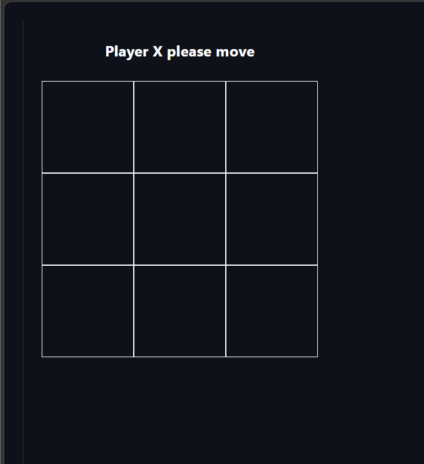
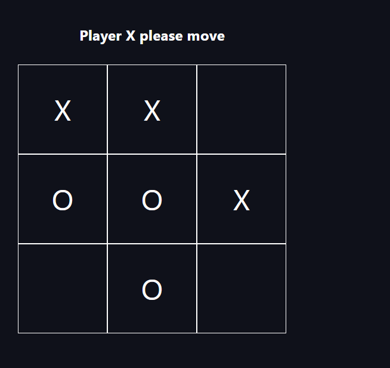
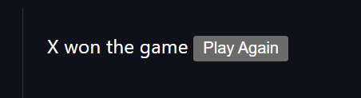

# Tic Tac Toe

A simple Tic Tac Toe game built using React and Vite.

## Features
- 3x3 Tic Tac Toe board
- Turn-based gameplay (X and O)
- Winner detection
- Play Again functionality
- Clean UI

## Tech Stack
- React
- Vite
- JavaScript
- CSS

## Screenshots

### Empty Board


### Gameplay


### Winner Screen


## Run Locally

```bash
npm install
npm run dev